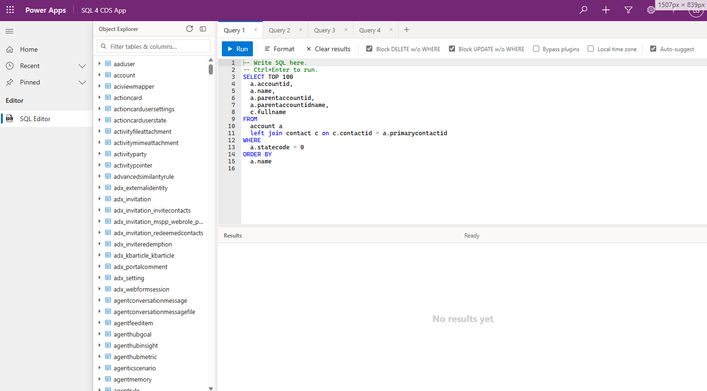

# Sql4CdsApp

A **Dataverse plugin and web resource wrapper** around [Sql4Cds](https://github.com/MarkMpn/Sql4Cds) that enables running SQL queries against Dataverse directly from the **model-driven app web UI** without any external dependencies and configuration required.

## How to install?

A Dataverse solution will be available for download once this becomes ready for release. Currently it's early work in progress.

## Overview

Sql4CdsApp integrates the Sql4Cds SQL engine into the Dataverse platform by combining:

- **Dataverse Plugins** — server-side logic that executes SQL queries via the Sql4Cds engine in a sandboxed plugin context
- **TypeScript Web Resources** — a browser-based SQL editor embedded in a model-driven app page, providing a developer/admin UI for writing and executing SQL against Dataverse tables

This allows users with appropriate Dataverse roles to run SQL queries against their environment directly from within a model-driven app, without needing external tools.

## License

See [LICENSE.txt](LICENSE.txt).
